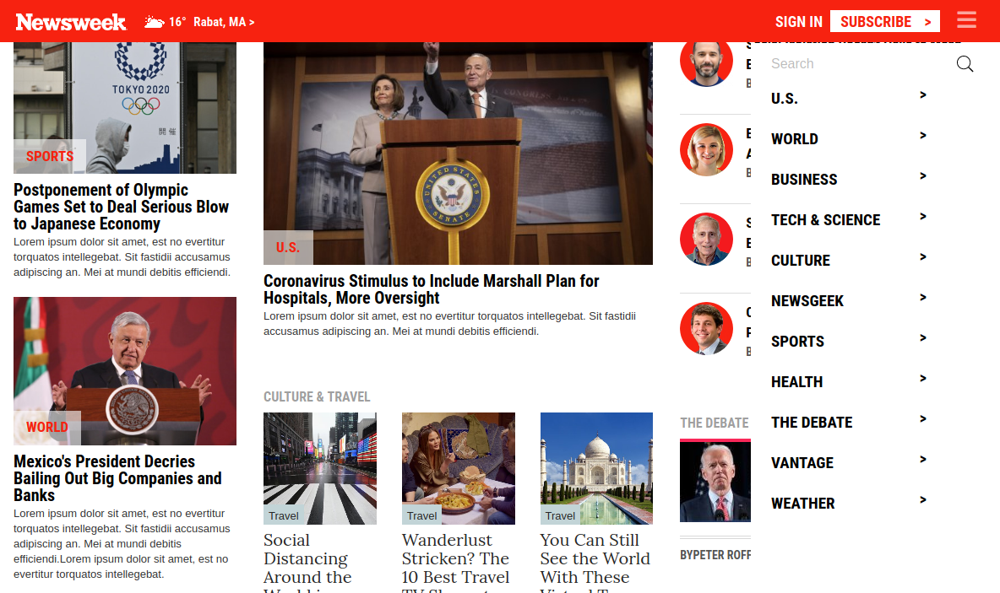

# Responsive web : Creating a responsive web page with Bootstrap


## Description:
In this project, I tried to build a clone of [the Newsweek](https://newsweek.com/) web page. The purpose of this exercise is to practice web responsiveness, typography styling and, above all ,to learn about Bootsrap and its uses.


## Built With:
- HTML & CSS
- Bootstrap 4
- Bootstrap's grid
- Bootstrap's flex box

## Code Review Tools:
- [W3 HTML Validator](https://validator.w3.org/)
- CSS linter : [Stickler](https://stickler-ci.com/)
- The fabulous Microverse's team :)


## Usage:
```Git
git clone https://github.com/CalyCherkaoui/Newsweek-cloneWithBootstrap.git
cd Newsweek-cloneWithBootstrap
git checkout heatmap
firefox index.html
```


## Live Demo:
[Click here to see a live version of the project](https://rawcdn.githack.com/CalyCherkaoui/Newsweek-cloneWithBootstrap/4091f8fc49473858b17e89458b584c35ee149818/index.html)


## Author:

👩 **Houda Cherkaoui**
- Twitter: https://twitter.com/Houda59579688
- Github: https://github.com/CalyCherkaoui/
- Linkedin: https://www.linkedin.com/in/houda-cherkaoui-64106395/


## Contributing and support:
Pull requests are welcome. For major changes, please open an issue first to discuss what you would like to change.
Show your support to this project with a ⭐️ and let me now if you would like to become a contributor!


## Screenshots Demo of the project:

### Screenshot of the fold-out menu in the navigation bar (Hamburger):



### Screenshot of the desktop version:


### Screenshot of the tablet version:


### Screenshot of the mobile version:


